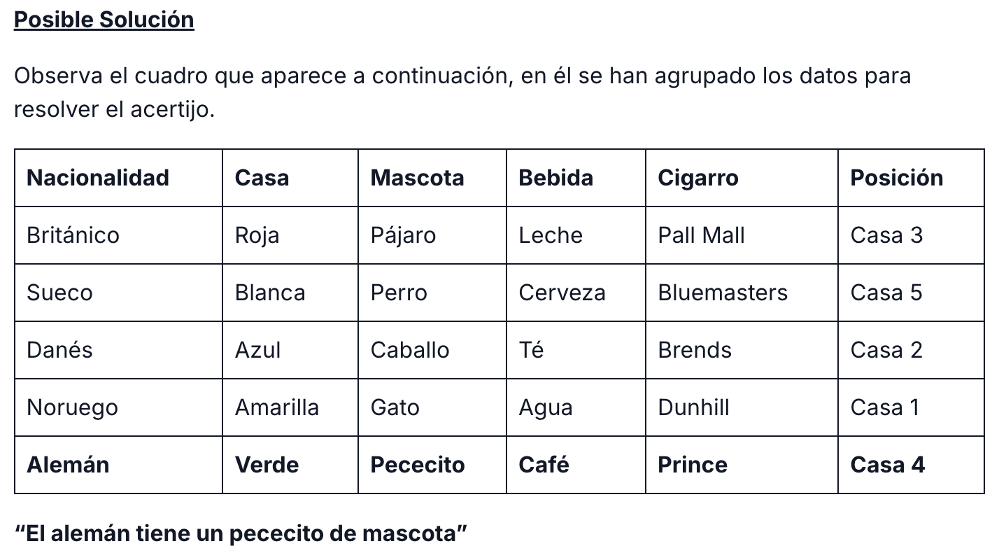

# Información
Esta es una implementación del Problema/Acertijo de Einstein resuelto con un Algoritmo Genético de la biblioteca [DEAP](https://deap.readthedocs.io).

# Enunciado del problema
Tenemos 5 casas de cinco colores diferentes y en cada una de ellas vive una persona de una nacionalidad diferente.

Por el momento no encuentra la solución optima, solo alcanza máximos de hasta 100 puntos de 111.

Cada uno de los dueños bebe una bebida diferente, fuma una marca de cigarrillos diferente y tiene una mascota diferente.

Considerando las siguientes claves:

1. El británico vive en la casa roja.
2. El sueco tiene un perro.
3. El danés toma té.
4. La casa verde está a la izquierda de la blanca.
5. El dueño de la casa verde toma café.
6. La persona que fuma Pall Mall tiene un pájaro.
7. El dueño de la casa amarilla fuma Dunhill.
8. El que vive en la casa del centro toma leche.
9. El noruego vive en la primera casa.
10. La persona que fuma Brends vive junto a la que tiene un gato.
11. La persona que tiene un caballo vive junto a la que fuma Dunhill.
12. El que fuma Bluemasters bebe cerveza.
13. El alemán fuma prince.
14. El noruego vive junto a la casa azul.
15. El que fuma Brends tiene un vecino que toma agua.

Y la pregunta: ¿Quién es el dueño del pececito?

# Solución


# Instrucciones de ejecución
```zsh
pip install deap
pip install plotly
python -m venv venv

python main.py
```
